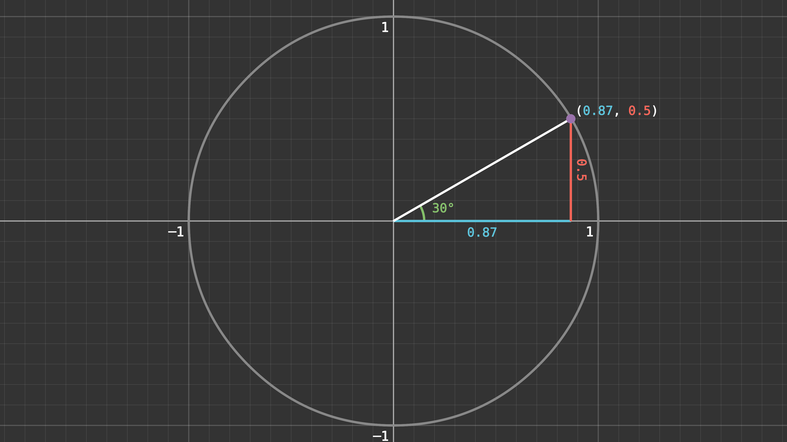

# Trig Triangle Manim

This is a ManimGL scene I made to draw the trigonometry unit-circle triangle, it uses a bunch of value trackers so you can easily animate it :)

I'd include the render but I can't figure out how to embed it so here's an image instead
